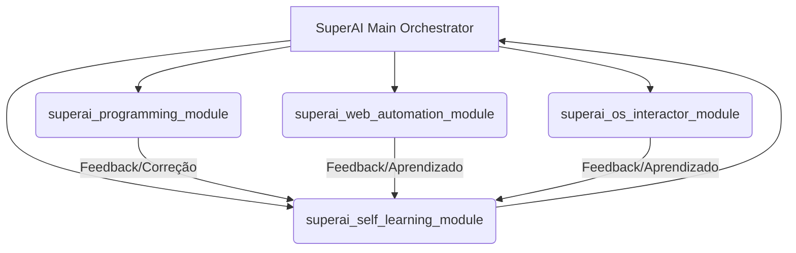

# Arquitetura do Sistema SuperAI

O sistema SuperAI é projetado com uma arquitetura modular, permitindo a integração e o desenvolvimento independente de suas principais funcionalidades. Cada módulo é responsável por uma área específica de inteligência e interação, trabalhando em conjunto para formar um agente de IA autônomo e auto-aprimorável.

## Visão Geral da Arquitetura

A arquitetura do SuperAI é composta pelos seguintes módulos principais:

1.  **Módulo de Programação Robusta com Auto-Correção (`superai_programming_module`):** Responsável pela geração, execução, teste e auto-correção de código Python. Este módulo permite que a IA desenvolva e refine suas próprias ferramentas e scripts.

2.  **Módulo de Navegação Web Extrema e Automação (`superai_web_automation_module`):** Habilita a IA a interagir com a web de forma avançada, incluindo a busca de informações, preenchimento de formulários e automação de tarefas online, sem depender de APIs externas de automação de navegador.

3.  **Módulo de Interação Completa com Sistemas Operacionais (`superai_os_interactor_module`):** Permite que a IA execute comandos no sistema operacional (Windows/Linux), gerencie arquivos e diretórios, e interaja com o ambiente computacional subjacente.

4.  **Módulo de Auto-Aprendizado Seguro (`superai_self_learning_module`):** O coração do sistema de auto-aprimoramento, este módulo permite que a IA aprenda com suas experiências, adapte suas regras e melhore seu desempenho ao longo do tempo, garantindo que a evolução seja controlada e segura.

## Fluxo de Treinamento e Operação

O `main.py` atua como o orquestrador do sistema, iniciando um ciclo contínuo de treinamento e operação. Durante o treinamento, cada módulo é exercitado e seus resultados são avaliados. O `SelfLearner` utiliza esses resultados para ajustar as regras de comportamento da IA, promovendo a auto-correção e o aprimoramento contínuo.

## Diagrama de Componentes

Esta arquitetura garante que a SuperAI seja resiliente, adaptável e capaz de evoluir suas capacidades de forma autônoma.
